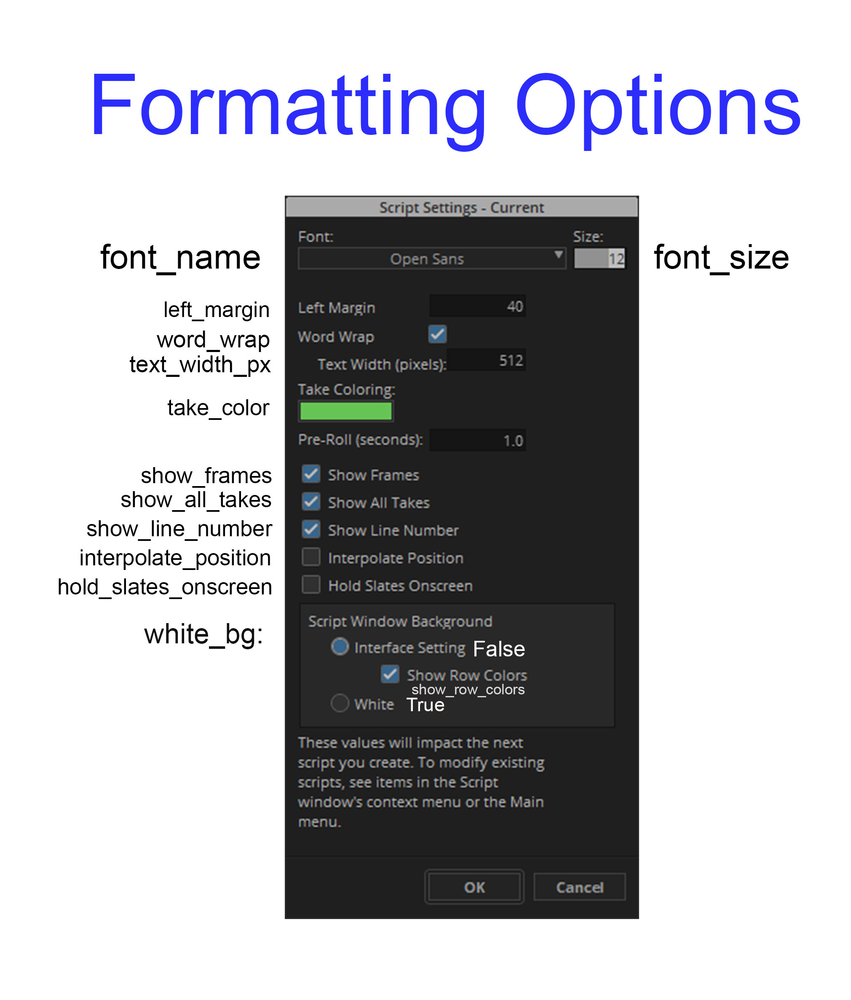

# pyavc

`pyavc` is a Python library that allows you to convert DOCX or TXT files into Avid Script (.avc) files. It can be used both as a command-line tool and as a library within your Python scripts.

This project is not affiliated with Avid or Avid Media Composer; it is simply an open-source helper library to make fellow AEs' lives a bit easier.

## Installation

To install `pyavc`, you can use `pip3`:

```
pip3 install pyavc
```

## Import Syntax

Use the following syntax to import the functionality into your Python script:

```
from avc.core import convert
```

## Usage

### As a Python Library

The main (and only) method provided is `convert`. It allows you to convert a DOCX or TXT file and save the result to a specified output directory, with extensive formatting options.

```
convert(filepath,
    output_dir,
    output_name=None,
    text_width=80,
    font_size=12,
    font_name="Open Sans",
    white_bg=False,
    show_row_colors=True,
    left_margin=40,
    text_width_px=512,
    show_frames=True,
    interpolate_position=False,
    show_all_takes=True,
    show_line_numbers=True,
    word_wrap=True,
    hold_slates_onscreen=False,
    take_color=1
    )
```

**HINT:** Only the input file and output folder path are mandatory. The default values are configured to match Avid's default settings. **Keyword arguments are highly recommended** (though not enforced), as they allow you to pick and choose which parameters you actually want to alter.

#### Parameters

* **`filepath`** (`str`): The path to the input DOCX or TXT file. If using a TXT file, it must be encoded as UTF-8.
* **`output_dir`** (`str`): The path to the output directory where the converted file will be saved.
* **`output_name`** (`str`, optional): The name of the output file (without extension). If not provided, the name is based on the input file. `pyavc` will not overwrite existing files but will append a number to the filename. Defaults to `None`.
* **`text_width`** (`int`, optional): The maximum number of characters before a line break is inserted. This avoids paragraphs being treated as a single line in Avid. Defaults to `80`.
* **`font_size`** (`int`, optional): The display font size in pixels. Maximum size is 255. Defaults to `12`.
* **`font_name`** (`str`, optional): The name of the font to use (e.g., "Arial", "Courier New"). If an invalid font is supplied, Avid will use a system default. Defaults to `"Open Sans"`.
* **`white_bg`** (`bool`, optional): If `True`, the script background will be white. If `False`, it defers to Avid's user settings. Defaults to `False`.
* **`show_row_colors`** (`bool`, optional): If `True`, rows will have alternating background colors for readability. Defaults to `True`.
* **`left_margin`** (`int`, optional): The left margin size in pixels. Defaults to `40`.
* **`text_width_px`** (`int`, optional): The width of the text area in pixels. This is for display purposes and does not insert line breaks. Minimum is 128, maximum is 5120. Defaults to `512`.
* **`show_frames`** (`bool`, optional): If `True`, a small thumbnail is displayed on the slate. Defaults to `True`.
* **`interpolate_position`** (`bool`, optional): If `True`, allows you to add your own manual sync marks in Avid. Defaults to `False`.
* **`show_all_takes`** (`bool`, optional): If `True`, all takes are displayed. If `False`, only the primary take is shown. Defaults to `True`.
* **`show_line_numbers`** (`bool`, optional): If `True`, line numbers are displayed. Defaults to `True`.
* **`word_wrap`** (`bool`, optional): If `True`, long lines of text will wrap visually to fit within the margins. Defaults to `True`.
* **`hold_slates_onscreen`** (`bool`, optional): If `True`, slate information remains visible in the record monitor until the next slate appears. Defaults to `False`.
* **`take_color`** (`int`, optional): An integer from 1-22 to select a highlight color for takes. See the color mapping table below for details. Defaults to `1`.

#### How the options map to Media Composer's native settings dialog:


#### Example Usage

```
from avc.core import convert

# Convert a TXT file with default settings, using positional arguments
convert('/path/to/input.txt', '/path/to/output/dir')

# Convert a DOCX file with a custom output name and font, using keyword arguments
convert(filepath='/path/to/input.docx', output_dir='/path/to/output/dir', output_name='custom_name', font_name='Arial')
```

### Command-Line Usage

`pyavc` can also be used from the command line to quickly convert files.

#### Syntax

```
pyavc -i <path> -o <path> [options]
```

#### Parameters

* **`-i, --input`**: **(Required)** Path to the input DOCX or TXT file.
* **`-o, --output_dir`**: **(Required)** Path to the output directory.
* **`-n, --output_name`**: (`str`, optional) Name of the output file (without extension). If not provided, it will be set by the file name of the input file.
* **`-t, --text_width`**: (`int`, optional) Max characters before inserting a line break.
* **`-f, --font_size`**: (`int`, optional) Desired display font size in pixels.
* **`-fn, --font_name`**: (`str`, optional) Name of the font to use.
* **`-wbg, --white_bg`**: (`bool`, optional) Use a white background.
* **`-r, --show_row_colors`**: (`bool`, optional) Show alternating row colors.
* **`-ml, --margin_left`**: (`int`, optional) Left margin size in pixels.
* **`-tpx, --text_width_px`**: (`int`, optional) The width of the text area in pixels for display.
* **`-sf, --show_frames`**: (`bool`, optional) Display mini thumbnail on the slate.
* **`-ip, --interpolate_position`**: (`bool`, optional) Allow manual sync marks.
* **`-a, --show_all_takes`**: (`bool`, optional) Show all takes instead of only the primary.
* **`-ln, --show_line_numbers`**: (`bool`, optional) Show line numbers.
* **`-ww, --word_wrap`**: (`bool`, optional) Wrap long lines visually.
* **`-hs, --hold_slates_onscreen`**: (`bool`, optional) Hold slates on screen in the record monitor.
* **`-tk, --take_color`**: (`int`, optional) An integer (1-22) to specify the take highlight color.

#### `take_color` Palette

| take_color | Color | Hex Code |
| :--- | :--- | :--- |
| 1 |  | `#BEBEBE` |
| 2 |  | `#C04BA0` |
| 3 |  | `#C73939` |
| 4 |  | `#C17E52` |
| 5 |  | `#C0C356` |
| 6 |  | `#65C453` |
| 7 |  | `#5A97E2` |
| 8 |  | `#5846E4` |
| 9 |  | `#FF0000` |
| 10 |  | `#80FFB8` |
| 11 |  | `#007FFF` |
| 12 |  | `#595959` |
| 13 |  | `#7E3169` |
| 14 |  | `#802424` |
| 15 |  | `#7E5235` |
| 16 |  | `#7E8038` |
| 17 |  | `#428036` |
| 18 |  | `#3B6393` |
| 19 |  | `#392E94` |
| 20 |  | `#80F1FF` |
| 21 |  | `#B880FF` |
| 22 |  | `#F1FF80` |
#### Example Commands

```
# Convert a TXT file and save the output
pyavc -i /path/to/input.txt -o /path/to/output/dir

# Convert a DOCX file and specify a custom output name
pyavc -i /path/to/input.docx -o /path/to/output/dir -n custom\_name

# Convert a DOCX file with a custom name, text width, font size, and take color
pyavc -i /path/to/input.docx -o /path/to/output/dir -n MyCustomName -t 50 -f 35 -tk 7
```

## License

This project is licensed under the GPL 3.0 License. See the `LICENSE` file for more details.

## Contributing

Contributions are welcome\! Please open an issue or submit a pull request with any improvements or suggestions. I am but a humble assistant editor and programming is more a hobby than a profession, so I'm always open to feedback.

## Some Notes

This library is still in the 'finishing touches' phase, and as always, there may be undiscovered bugs.

## Acknowledgments

`pyavc` would not be possible without the [pyavb library by markreidvfx](https://github.com/markreidvfx/pyavb), which provided so many useful hints. As it turns out, AVC files are constructed much like AVB files. Who would have thought?